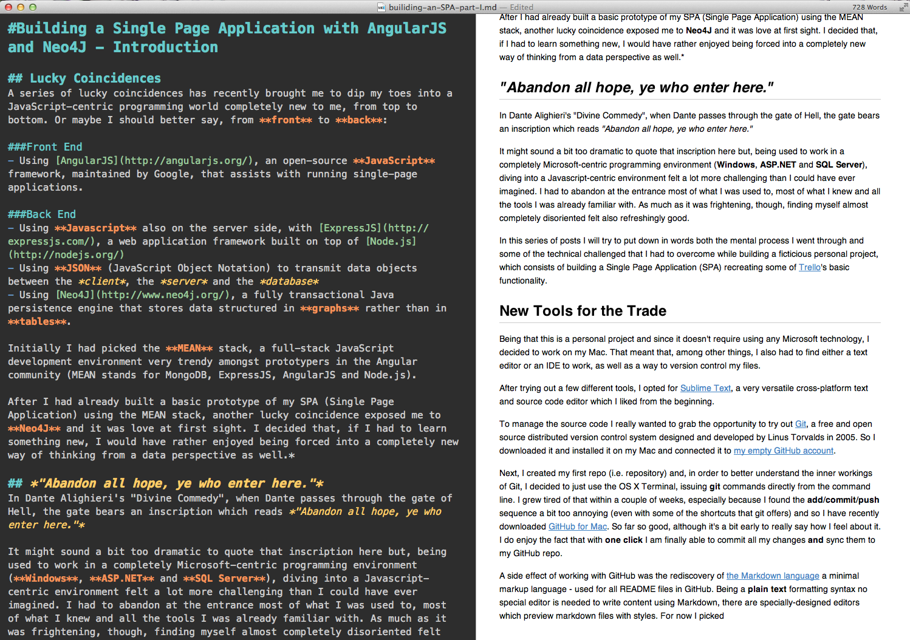

#Building a Single Page Application with AngularJS and Neo4J - Introduction

## Lucky Coincidences
A series of lucky coincidences has recently brought me to dip my toes into a JavaScript-centric programming world completely new to me, from top to bottom. Or maybe I should better say, from **front** to **back**:

###Front End
- Using [AngularJS](http://angularjs.org/), an open-source **JavaScript** framework, maintained by Google, that assists with running single-page applications.

###Back End
- Using **Javascript** also on the server side, with [ExpressJS](http://expressjs.com/), a web application framework built on top of [Node.js](http://nodejs.org/)
- Using **JSON** (JavaScript Object Notation) to transmit data objects between the *client*, the *server* and the *database*
- Using [Neo4J](http://www.neo4j.org/), a fully transactional Java persistence engine that stores data structured in **graphs** rather than in **tables**.

Initially I had picked the **MEAN** stack, a full-stack JavaScript development environment very trendy amongst prototypers in the Angular community (MEAN stands for MongoDB, ExpressJS, AngularJS and Node.js).

After I had already built a basic prototype of my SPA (Single Page Application) using the MEAN stack, another lucky coincidence exposed me to **Neo4J** and it was love at first sight. I decided that, if I had to learn something new, I would have rather enjoyed being forced into a completely new way of thinking from a data perspective as well.*

## *"Abandon all hope, ye who enter here."*
In Dante Alighieri's "Divine Commedy", when Dante passes through the gate of Hell, the gate bears an inscription which reads *"Abandon all hope, ye who enter here."* 

It might sound a bit too dramatic to quote that inscription here but, being used to work in a completely Microsoft-centric programming environment (**Windows**, **ASP.NET** and **SQL Server**), diving into a Javascript-centric environment felt a lot more challenging than I could have ever imagined. I had to abandon at the entrance most of what I was used to, most of what I knew and all the tools I was already familiar with. As much as it was frightening, though, finding myself almost completely disoriented felt also refreshingly good. 

In this series of posts I will try to put down in words both the mental process I went through and some of the technical challenged that I had to overcome while building a ficticious personal project, which consists of building a Single Page Application (SPA) recreating some of [Trello](https://trello.com/)'s basic functionality.

## New Tools for the Trade
Being that this is a personal project and since it doesn't require using any Microsoft technology, I decided to work on my Mac. That meant that, among other things, I also had to find either a text editor or an IDE to work, as well as a way to version control my files.

After trying out a few different tools, I opted for [Sublime Text](http://www.sublimetext.com/2), a very versatile cross-platform text and source code editor which I liked from the beginning.

To manage the source code I really wanted to grab the opportunity to try out [Git](http://git-scm.com/), a free and open source distributed version control system designed and developed by Linus Torvalds in 2005. So I downloaded it and installed it on my Mac and connected it to [my empty GitHub account](https://github.com/gallarotti).

Next, I created my first repo (i.e. repository) and, in order to better understand the inner workings of Git, I decided to just use the OS X Terminal, issuing **git** commands directly from the command line. I grew tired of that within a couple of weeks, especially because I found the **add**/**commit**/**push** sequence a bit too annoying (even with some of the shortcuts that git offers) and so I have recently downloaded [GitHub for Mac](http://mac.github.com/). So far so good, although it's a bit early to really say how I feel about it. I do enjoy the fact that with **one click** I am finally able to commit all my changes **and** sync them to my GitHub repo.

A side effect of working with GitHub was the rediscovery of [the Markdown language](http://daringfireball.net/projects/markdown/) a minimal markup language - used for all README files in GitHub. Being a **plain text** formatting syntax no special editor is needed to write content using Markdown, there are specially-designed editors which preview markdown files with styles. For now I picked [Mou](http://mouapp.com/) a very nice markdown editor which provides instant preview side-by-side to the text being edited.

Coincidentally, just few weeks ago, finally, [Wordpress has announced](http://1000linesofcode.wordpress.com/2013/12/29/perfect-timing-markdown-on-wordpress/) that they are now supporting GitHub's version of Markdown within the blog post editor! Perfect timing for me to really get addicted to this simple writing tool! Because Markdown is simple enough to learn in a few minutes, clean and elegant enough to be readable no matter your context, becoming the defacto markup language of the Internet, at least among the slightly geekier types who know markup languages.

